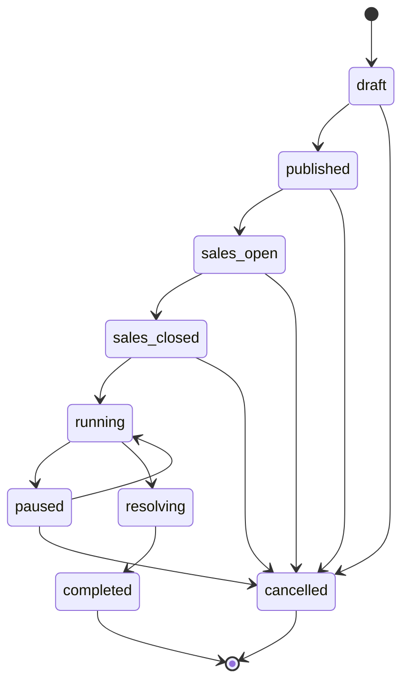
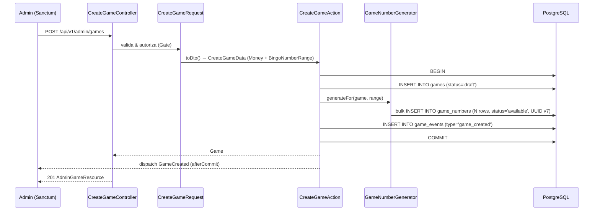

# RepeatNumberBingo — Fase 1

Backend inicial del módulo `RepeatNumberBingo`: administración del ciclo de
vida de una partida (sin venta de números, sin extracciones, sin payouts).
Esas capas llegarán en Fases 2–6.

## 1. Stack y configuración

| Pieza | Versión / valor |
| --- | --- |
| PHP | 8.2 |
| Laravel | 12.x |
| PHPUnit | 11.x |
| PostgreSQL | 16 (Docker, puerto host `55432`) |
| Redis | 7 (Docker, puerto host `56379`) — listo, sin uso en Fase 1 |
| Sanctum | 4.x — endpoint API token |

Variables nuevas en `.env` / `.env.example`:

```env
DB_CONNECTION=pgsql
DB_HOST=127.0.0.1
DB_PORT=55432
DB_DATABASE=backend_rifas_app
DB_TEST_DATABASE=backend_rifas_app_test
DB_USERNAME=rifas
DB_PASSWORD=secret
REDIS_PORT=56379
```

Levantar infra local:

```bash
docker compose up -d
```

El script `docker/postgres/init.sh` crea automáticamente la base
`backend_rifas_app_test` usada por las suites Feature/Integration.

## 2. Arquitectura

Monolito modular bajo `app/Modules/`.

```
app/
├── Actions/Users/ChangeUserRoleAction.php
├── Enums/UserRole.php
├── Http/Middleware/EnsureUserIsAdmin.php
├── Models/User.php                # canónico — sin re-export en Identity
└── Modules/
    ├── Shared/Domain/
    │   ├── Exceptions/{DomainException,ImmutableModelException}.php
    │   └── ValueObjects/Money.php
    └── RepeatNumberBingo/
        ├── Application/
        │   ├── Actions/{Create,Publish,OpenGameSales,CloseGameSales,Cancel}GameAction.php
        │   ├── Actions/SetScheduledStartAtAction.php
        │   ├── DTOs/CreateGameData.php
        │   └── Queries/{ListPublicGames,GetPublicGameDetail}Query.php
        ├── Domain/
        │   ├── Enums/{GameStatus,GameNumberStatus,GameEventType}.php
        │   ├── Events/{GameCreated,GamePublished,GameSalesOpened,
        │   │           GameSalesClosed,GameScheduledStartSet,GameCancelled}.php
        │   ├── Exceptions/{InvalidGameTransition,InvalidGameConfiguration}.php
        │   ├── Models/{Game,GameNumber,GameEvent}.php
        │   ├── Services/GameNumberGenerator.php
        │   └── ValueObjects/BingoNumberRange.php
        └── Presentation/Http/
            ├── Controllers/{Admin,Public}/*Controller.php
            ├── Policies/GamePolicy.php
            ├── Requests/Admin/{CreateGame,ScheduleGame,CancelGame}Request.php
            └── Resources/{PublicGame,AdminGame}Resource.php
```

Dirección de dependencias: `Presentation → Application → Domain ← Infrastructure`.
Eloquent vive en `Domain/Models` (DDD pragmático permitido por la skill).

## 3. Modelo de datos

**Identificadores UUID versión 7** en todas las tablas del dominio:

- Los modelos Eloquent (`Game`, `GameNumber`, `GameEvent`) usan el trait
  `HasUuids` de Laravel 12, cuyo `newUniqueId()` retorna `(string) Str::uuid7()`.
  Verificado empíricamente: el dígito de versión (índice 14) es `7`.
- Los inserts en bulk (p.ej. `GameNumberGenerator` que usa `DB::table()->insert()`
  saltando Eloquent) deben generar manualmente sus ids con `Str::uuid7()`.
- `tests/Integration/Game/Uuid7GenerationTest.php` cubre los tres casos
  (game, numbers bulk, events).

`users.id` permanece `BIGINT` (no se toca la migración base de Laravel).

### `users` (alteración)
- `role VARCHAR(16) NOT NULL DEFAULT 'player' CHECK IN ('admin','player')`
- **`role` NO está en `$fillable`** — se cambia exclusivamente vía
  `App\Actions\Users\ChangeUserRoleAction` con `forceFill`.

### `games`
- `id UUID PK`, `slug VARCHAR(120) UNIQUE`, `name`, `description`
- `number_min`, `number_max`, `hits_required` (`CHECK min ≥ 1`, `max > min`, `hits ≥ 2`)
- `ticket_price_cents BIGINT`, `prize_cents BIGINT`, `currency CHAR(3)` (`CHECK ~ '^[A-Z]{3}$'`)
- `sales_opens_at`, `sales_closes_at`, `scheduled_start_at` (`timestamptz nullable`)
- `draw_interval_seconds INT DEFAULT 30`, `auto_draw_enabled BOOL DEFAULT true`
- `status VARCHAR(24) CHECK IN ('draft','published','sales_open','sales_closed','running','paused','resolving','completed','cancelled')` — sin `scheduled`
- `settings JSONB nullable`
- `created_by BIGINT FK users.id nullOnDelete`
- Índices: `(status, sales_opens_at)`, `(status, scheduled_start_at)`

### `game_numbers`
- `id UUID PK`, `game_id UUID FK cascadeOnDelete`
- `number INT`, `status VARCHAR(16) CHECK IN ('available','reserved','sold')`
- **`UNIQUE(game_id, number)`** + índice `(game_id, status)`

### `game_events` (append-only, doblemente protegido)
- `id UUID PK`, `game_id UUID FK cascadeOnDelete`
- `type VARCHAR(48) CHECK IN (... 23 tipos, incluye 'scheduled_start_set')`
- `payload JSONB nullable`, `actor_user_id BIGINT FK users.id nullOnDelete`
- `occurred_at`, `created_at` (sin `updated_at` — `UPDATED_AT = null`)
- Índices: `(game_id, occurred_at)`, `(type)`
- **Hooks Eloquent** en `GameEvent::booted()`:
  `updating` y `deleting` lanzan `ImmutableModelException`.
- **Limitación conocida**: estos hooks solo protegen operaciones realizadas
  mediante el modelo Eloquent. Modificaciones directas vía `DB::table(...)`,
  Query Builder crudo o SQL nativo (`psql`) **no** son bloqueadas. Ver §11.

**Postergado a Fase 3**: `game_number_counters` (proyección reconstruible desde
`game_draws`).

## 4. Estados y transiciones



**Única fuente de verdad**: `GameStatus::allowedNextStates()`. `canTransitionTo()`
y `Game::transitionTo()` la consultan. Una transición inválida lanza
`InvalidGameTransition`, mapeada a HTTP 422 con `error: invalid_game_transition`.

`scheduled_start_at` es un **atributo configurable**, no un estado.
`SetScheduledStartAtAction` lo persiste sin cambiar `status`. Puede setearse
mientras el juego esté en `published`, `sales_open` o `sales_closed`. Reglas:

- La fecha debe ser estrictamente futura.
- Si `sales_closes_at` está definido, `scheduled_start_at` debe ser posterior.
- Reconfigurar la fecha está prohibido en `running`/`paused`/`resolving`/`completed`/`cancelled`.

La transición `sales_closed → running` (Fase 3, `StartGameAction`) deberá validar:
- `status === sales_closed`
- `scheduled_start_at !== null`
- `scheduled_start_at <= now()`
- No existe un ganador declarado
- El juego no fue iniciado previamente

## 5. Endpoints (`/api/v1`)

| Método | Ruta | Middleware | Acción |
| --- | --- | --- | --- |
| GET | `/public/games` | público | Listado paginado (oculta draft/cancelled) |
| GET | `/public/games/{slug}` | público | Detalle (404 para draft/cancelled) |
| GET | `/user` | `auth:sanctum` | Usuario autenticado |
| POST | `/admin/games` | `auth:sanctum + admin` | Crear partida + generar números |
| POST | `/admin/games/{game}/publish` | `auth:sanctum + admin` | draft → published |
| POST | `/admin/games/{game}/open-sales` | `auth:sanctum + admin` | published → sales_open |
| POST | `/admin/games/{game}/close-sales` | `auth:sanctum + admin` | sales_open → sales_closed |
| POST | `/admin/games/{game}/schedule` | `auth:sanctum + admin` | **Configura `scheduled_start_at` sin cambiar estado** |
| POST | `/admin/games/{game}/cancel` | `auth:sanctum + admin` | * → cancelled (donde sea permitido) |

`PublicGameResource` **nunca** expone `settings`, `created_by` ni `auto_draw_enabled`.
`AdminGameResource` sí.

## 6. Flujo de creación



## 7. Domain Events

Todos implementan `ShouldDispatchAfterCommit` para garantizar que listeners
(broadcasting, notificaciones, proyecciones) **solo** ven datos confirmados.
La auditoría **no** depende de ellos — `game_events` se inserta dentro de la
misma transacción del Action.

| Evento | Carga | Cuándo |
| --- | --- | --- |
| `GameCreated` | `gameId` | Tras crear game + generar números |
| `GamePublished` | `gameId` | draft → published |
| `GameSalesOpened` | `gameId` | published → sales_open |
| `GameSalesClosed` | `gameId` | sales_open → sales_closed |
| `GameScheduledStartSet` | `gameId`, `scheduledStartAt` | atributo `scheduled_start_at` (re)configurado, sin cambio de estado |
| `GameCancelled` | `gameId`, `reason` | * → cancelled |

## 8. Patrones aplicados / descartados

**Aplicados:**
- Action / Use Case (6 actions de juego + `ChangeUserRoleAction`)
- DTO `readonly` (`CreateGameData`, valida invariantes cross-field)
- Enum-based State + método de transición en el modelo (única fuente de verdad)
- Value Objects: `Money` (Shared), `BingoNumberRange`
- Domain Events `ShouldDispatchAfterCommit`
- Query Objects (`ListPublicGamesQuery`, `GetPublicGameDetailQuery`)
- API Resources (Public/Admin separados)
- Policies (`GamePolicy`)
- Auditoría transaccional vía `game_events`
- Inmutabilidad declarativa de modelos (`booted()` hooks + excepción tipada)

**Descartados en Fase 1 (con justificación):**
- **Strategy / `DrawStrategy`** — todavía no hay extracción.
- **Factory de dominio** — `CreateGameAction` + `GameNumberGenerator` ya encapsulan la creación compleja.
- **Repository genérico** — Eloquent + `lockForUpdate` desde los Actions es suficiente.
- **State classes (una clase por estado)** — Enum + método `canTransitionTo` basta.
- **Adapter de pago** — sin segunda implementación, sería interfaz vacía.
- **`GameTransitionGuard`** — habría duplicado la matriz que vive en `GameStatus`.
- **`game_number_counters`** — proyección sin valor en Fase 1.
- **Módulo `Identity`** — `ChangeUserRoleAction` vive en `app/Actions/Users/` hasta que aparezca suficiente lógica de identidad que justifique un módulo.

## 9. Estrategia de pruebas

| Suite | DB | Qué cubre |
| --- | --- | --- |
| Unit | sin DB | `Money`, `BingoNumberRange`, matriz `GameStatus` (incluye verificación de que `scheduled` no es estado) |
| Feature | PostgreSQL `backend_rifas_app_test` | endpoints públicos + admin completos, autorización 401/403, validación 422, transiciones, auditoría, dispatch de eventos, **seguridad role mass-assignment** |
| Integration | PostgreSQL real | `UNIQUE` slug, `UNIQUE(game_id, number)`, JSONB roundtrip, **inmutabilidad de `GameEvent`**, **UUID v7** en game/numbers/events |

### Concurrencia en Windows

`pcntl_fork` no está disponible. Las pruebas de concurrencia (Fase 2+)
usarán conexiones PDO independientes o quedarán documentadas como
"ejecutables en Linux/Docker".

## 10. Decisiones operativas (no obvias)

1. **Puertos host 55432 / 56379**: el puerto 5432 ya estaba ocupado por
   `casa_bonita_postgres` (otro proyecto del usuario).
2. **Credenciales `rifas/secret`**: el contenedor oficial de Postgres no
   acepta password vacío.
3. **UUID v7 vía `HasUuids` + `Str::uuid7()`**: `Str::uuid7()` y la
   generación interna del trait `HasUuids` en Laravel 12.62 producen
   UUID v7 reales (`Ramsey\Uuid\Uuid::uuid7()`). Para bulk inserts que
   eluden Eloquent (caso de `GameNumberGenerator::generateFor()`) se debe
   llamar `Str::uuid7()` manualmente — `Str::orderedUuid()` produce v4.
4. **`CHECK` solo en `pgsql`**: las migraciones envuelven los `DB::statement`
   con `if (DB::getDriverName() === 'pgsql')`.
5. **`scheduled` no es estado**: simplifica la máquina y permite mostrar
   countdown público desde `published` o `sales_open` sin acoplar la fecha
   al cierre de ventas. Decisión registrada para evitar regresión.
6. **`role` fuera de `$fillable`**: defensa contra mass-assignment incluso
   sin endpoints de registro/edición públicos. El cambio de rol pasa solo
   por `ChangeUserRoleAction` con `forceFill`.

## 11. Pendientes / próximos pasos

### Mejora futura — triggers PostgreSQL para `game_events`

Los hooks Eloquent protegen las operaciones del modelo, **no** las
modificaciones directas vía Query Builder o `psql`. Para defensa en
profundidad (Fase 6 — auditoría pública avanzada) se propone:

```sql
CREATE OR REPLACE FUNCTION game_events_block_modify() RETURNS trigger AS $$
BEGIN
  RAISE EXCEPTION 'game_events is append-only (% blocked)', TG_OP;
END;
$$ LANGUAGE plpgsql;

CREATE TRIGGER game_events_no_update BEFORE UPDATE ON game_events
  FOR EACH ROW EXECUTE FUNCTION game_events_block_modify();
CREATE TRIGGER game_events_no_delete BEFORE DELETE ON game_events
  FOR EACH ROW EXECUTE FUNCTION game_events_block_modify();
```

Implicación: `migrate:fresh` y seeders necesitarían
`SET session_replication_role = 'replica'` para limpiar la tabla. Se
implementará junto con la infraestructura de auditoría pública.

### Reglas de `StartGameAction` (a implementar en Fase 3)

Antes de transitar `sales_closed → running`, el action deberá validar:
- `status === sales_closed`
- `scheduled_start_at !== null`
- `scheduled_start_at <= now()`
- No existe un `GameWinner` declarado
- El juego no fue iniciado previamente (idempotencia)

### Roadmap

- **Fase 2**: reservas (`number_reservations`), órdenes, pagos manuales con
  evidencias, `idempotency_keys`, liberación de reservas expiradas.
- **Fase 3**: `StartGameAction` con las validaciones de arriba, `game_draws`,
  `SecureRandomDrawStrategy`, detección de ganador, `game_winners`,
  `game_number_counters`.
- **Fase 4**: Redis Lock, Job `DrawNextNumberJob`, extracción automática,
  pausa/reanudación.
- **Fase 5**: Reverb / broadcasting de los Domain Events ya preparados.
- **Fase 6**: `payouts`, evidencias públicas anonimizadas, triggers de
  inmutabilidad de `game_events`.
